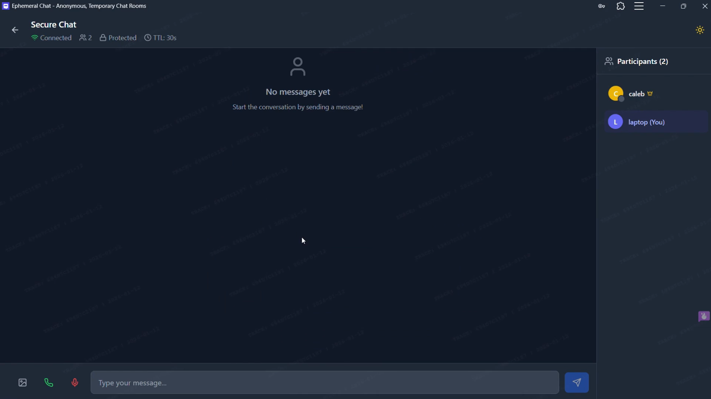

<div align="center">
  
  <h1>Ephemeral Chat</h1>
  
  <p align="center">
    <strong>Secure, anonymous, and ephemeral communication with self-destructing magic.</strong>
  </p>

  <p align="center">
    <a href="https://opensource.org/licenses/Apache-2.0"></a>
    <a href="https://github.com/cLLeB/ephemeral-chat/issues"></a>
    <a href="https://chat.kyere.me/"></a>
  </p>

  <p align="center">
    <a href="#-features">Features</a> •
    <a href="#-quick-start">Quick Start</a> •
    <a href="#-tech-stack">Tech Stack</a> •
    <a href="#-architecture">Architecture</a> •
    <a href="#-deployment">Deployment</a>
  </p>
</div>

---

## 🎥 Experience the Magic

Watch how Ephemeral Chat redefines private communication:

[](https://youtu.be/gnvoWkvkkho)

### 📸 Sneak Peek

<p align="center">
   
   
</p>

---

## ✨ Features

### 💬 Seamless Messaging
- **Real-Time Engine**: Instant message delivery powered by Socket.io.
- **📞 Hybrid Voice Calls**: Crystal clear P2P audio with WebRTC, falling back to Agora for rock-solid reliability.
- **🎤 Universal Voice Notes**: Record on any device. Our backend handles conversion to AAC (.m4a) for flawless playback on iOS Safari and everywhere else.
- **📸 Secure Media**: Share images with "View Once" capability.

### 🛡️ Privacy First
- **� End-to-End Encryption**: AES-GCM encryption happens in your browser. Keys stay in the URL hash—never sent to our server.
- **� Zero Persistence**: Messages live in memory and self-destruct after reading or a set timeout.
- **🚪 Guarded Entry**: Host-controlled "Knock-to-Join" system and optional room passwords.
- **🤖 Anti-Spam**: Integrated Proof-of-Work CAPTCHA protects every room.

### � Native Experience
- **PWA Ready**: Installable on any device for a native app feel.
- **TWA Distribution**: Optimized for Android via Google Play Store (Trusted Web Activity).
- **Offline Shell**: Quick loading with cached essential assets.

---

## 🛠️ Tech Stack

| Frontend | Backend | DevOps |
| :--- | :--- | :--- |
| **React** & **Vite** | **Node.js** & **Express** | **Docker** Ready |
| **Tailwind CSS** | **Socket.io** | **GitHub Actions** CI/CD |
| **Lucide Icons** | **FFmpeg** (Processing) | **CodeQL** Analysis |
| **WebRTC & Agora** | **Redis** (Scaling) | **Render** Hosting |

---

## 🚀 Quick Start

### 1. Requirements
Ensure you have **Node.js (v16+)** and **npm (v8+)** installed.

### 2. Installation
```bash
# Clone the repo
git clone https://github.com/cLLeB/ephemeral-chat.git
cd ephemeral-chat

# Install dependencies for both root and client
npm install
cd client && npm install && cd ..
```

### 3. Configuration
Copy the template and add your credentials:
```bash
cp client/.env.example client/.env
```

<details>
<summary>🔑 <b>Click to see Environment Variables Guide</b></summary>

| Variable | Description |
| :--- | :--- |
| `VITE_AGORA_APP_ID` | Your Agora project ID |
| `VITE_AGORA_TOKEN` | Agora primary certificate / token |
| `INACTIVITY_TIMEOUT` | Minutes before a room is cleared |
| `CAP_SECRET` | Secret key for Captcha system |

</details>

### 4. Run Locally
```bash
npm run dev
```
- **Frontend**: [http://localhost:5173](http://localhost:5173)
- **Backend**: [http://localhost:3001](http://localhost:3001)

---

## 🏗️ Architecture & Deep Dives

<details>
<summary><b>📐 Hybrid Call State Machine</b></summary>

We use a sophisticated failover logic for audio calls:
1. **P2P Mode**: Uses WebRTC via Google STUN and ExpressTURN.
2. **Fallback**: Auto-switches to Agora SDK if:
   - Packet loss exceeds 5%.
   - More than 3 participants join.
   - P2P connection fails to establish.

</details>

<details>
<summary><b>🔒 Encryption Architecture</b></summary>

Using **AES-GCM (256-bit)**:
1. Room key is generated locally on creation.
2. Key is appended to the URL as a fragment identifier (`#key`).
3. Fragment identifiers are *never* sent to the server.
4. Messages are encrypted/decrypted entirely client-side.

</details>

<details>
<summary><b>🌍 ICE Server Configuration</b></summary>

```javascript
[
   { urls: "stun:stun.l.google.com:19302" },
   { urls: "turn:free.expressturn.com:3478?transport=udp", username: "...", credential: "..." },
   { urls: "turn:relay.metered.ca:80", username: "...", credential: "..." }
]
```

</details>

---

## 🏗️ Project Structure

```text
ephemeral-chat/
├── android/          # Android TWA project (Play Store)
├── client/           # React frontend (Vite + PWA)
│   ├── src/          # React components, hooks, services
│   └── public/       # PWA manifest and icons
├── server/           # Express + Socket.IO backend
│   ├── auth-utils.js # Security & Validation
│   └── rooms.js      # Room management logic
└── docs/             # Detailed user and dev guides
```

---

## 🤝 Contributing & License

We love contributions! Please feel free to open an issue or submit a pull request.

**License**: Distributed under the **Apache License 2.0**. See `LICENSE` and `NOTICE` for details.

---
<div align="center">
  <i>Maintained and Powered by <a href="https://chat.kyere.me/">Caleb Kyere-Boateng</a></i>
</div>
