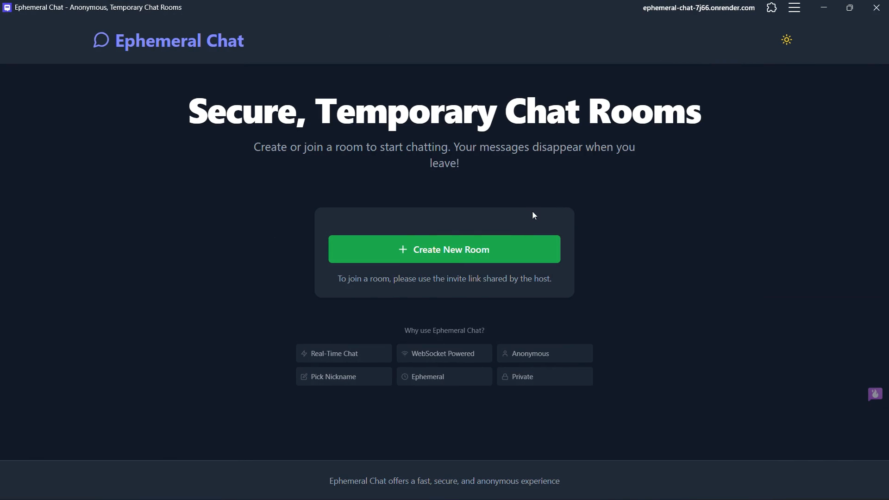

# 👻 Ephemeral Chat
**The Gold Standard for Zero-Persistence, Encrypted Communication.**

Ephemeral Chat is a high-security, anonymous messaging platform built for users who demand absolute privacy. No accounts, no logs.

  <p align="center">
    <a href="https://opensource.org/licenses/Apache-2.0"></a>
    <a href="https://github.com/cLLeB/ephemeral-chat/issues"></a>
    <a href="https://talk.kyere.me/"></a>
  </p>

  <p align="center">
    <a href="#-features">Features</a> •
    <a href="#-quick-start">Quick Start</a> •
    <a href="#-tech-stack">Tech Stack</a> •
    <a href="#-architecture">Architecture</a> •
    <a href="#-deployment">Deployment</a>
  </p>
</div>

---

## 🎥 Experience the Magic

Watch how Ephemeral Chat redefines private communication:

[](https://youtu.be/gnvoWkvkkho)

### 📸 Sneak Peek

<p align="center">
   
   
</p>

---

## ⚡ Advanced Features

### 🔐 Ironclad Privacy
- **E2EE (AES-GCM)**: Military-grade 256-bit encryption performed entirely in-browser. Keys are stored in the URL fragment (`#`) and never traverse the network.
- **Snapshot Protection**: 
    - **Privacy Blur**: Instant grayscale blur applied to the UI when focus is lost.
    - **iOS Guard**: Automatic black-screen overlay to prevent sensitive snapshots in the App Switcher.
    - **Ghost Watermark**: Dynamic, drifting watermark Layer that rotates and moves to deter AI-based OCR and screenshot reconstruction.
- **Stealth Password Entry**: Invisible input system for room passwords—no characters, no dots, zero visual footprint.

### 🎙️ Elite Communication
- **Hybrid Voice Engine**: A state-of-the-art failover system. Starts with **WebRTC P2P** for low latency and auto-scales to **Agora RTM/RTC** if network conditions degrade or participant count increases.
- **Universal Voice Notes**: Backend FFmpeg pipeline converts recordings to AAC (.m4a) on-the-fly, ensuring flawless playback across iOS, Android, and Desktop.
- **Targeted Messaging**: Granular control over message recipients within a room, orchestrated via a secure server relay.

### 🛡️ System Integrity
- **Proof-of-Work CAPTCHA**: Custom `@cap.js/widget` implementation for anti-spam without compromising user anonymity.
- **Zero-Persistence**: All data resides in volatile memory (RAM). Once the last user departs, the environment is scrubbed.
- **Micro-interactions**: Animated message delivery and "vanishing" effects powered by optimized CSS transforms.

---

## 🛠️ Tech Stack

| Frontend | Backend | DevOps |
| :--- | :--- | :--- |
| **React** & **Vite** | **Node.js** & **Express** | **Docker** Ready |
| **Tailwind CSS** | **Socket.io** | **GitHub Actions** CI/CD |
| **Lucide Icons** | **FFmpeg** (Processing) | **CodeQL** Analysis |
| **WebRTC & Agora** | **Redis** (Scaling) | **Render** Hosting |

---

## 🚀 Quick Start

### 1. Requirements
Ensure you have **Node.js (v16+)** and **npm (v8+)** installed.

### 2. Installation
```bash
# Clone the repo
git clone https://github.com/cLLeB/ephemeral-chat.git
cd ephemeral-chat

# Install dependencies for both root and client
npm install
cd client && npm install && cd ..
```

### 3. Configuration
Copy the template and add your credentials:
```bash
cp client/.env.example client/.env
```

<details>
<summary>🔑 <b>Click to see Environment Variables Guide</b></summary>

| Variable | Description |
| :--- | :--- |
| `VITE_AGORA_APP_ID` | Your Agora project ID |
| `INACTIVITY_TIMEOUT` | Minutes before a room is cleared |
| `CAP_SECRET` | Secret key for Captcha system |

</details>

### 4. Run Locally
```bash
npm run dev
```
- **Frontend**: [http://localhost:5173](http://localhost:5173)
- **Backend**: [http://localhost:3001](http://localhost:3001)

---

## 🏗️ Architecture & Deep Dives

<details>
<summary><b>📐 Hybrid Call State Machine</b></summary>

We use a sophisticated failover logic for audio calls:
1. **P2P Mode**: Uses WebRTC via Google STUN and ExpressTURN.
2. **Fallback**: Auto-switches to Agora SDK if:
   - Packet loss exceeds 5%.
   - More than 3 participants join.
   - P2P connection fails to establish.

</details>

<details>
<summary><b>🔒 Security & Encryption Deep Dive</b></summary>

Using **Web Crypto API (AES-GCM 256-bit)**:
1. **Key Generation**: A cryptographically strong pseudo-random key is generated on the client.
2. **Key Storage**: The key is stored in `window.location.hash`. Fragment identifiers are client-side only and are **never** included in HTTP requests.
3. **Encryption**: Every message is encrypted with a unique Initialization Vector (IV).
4. **Targeting**: Private messages are encrypted and tagged with specific recipient IDs for the server to relay exclusively to the intended sockets.

</details>

<details>
<summary><b>📱 Multi-Platform Architecture</b></summary>

- **PWA**: Fully offline-capable service workers using Workbox.
- **TWA (Android)**: Wrapped via Trusted Web Activity for Google Play Store distribution, utilizing Digital Asset Links for seamless verification.
- **Microsoft Store**: Packaged PWA optimized for Windows 10/11 system integration.

</details>

<details>
<summary><b>🌍 ICE Server Configuration</b></summary>

```javascript
[
   { urls: "stun:stun.l.google.com:19302" },
   { urls: "turn:free.expressturn.com:3478?transport=udp", username: "...", credential: "..." },
   { urls: "turn:relay.metered.ca:80", username: "...", credential: "..." }
]
```

</details>

---

## 🏗️ Project Structure

```text
ephemeral-chat/
├── android/          # Android TWA project (Play Store)
├── client/           # React frontend (Vite + PWA)
│   ├── src/          # React components, hooks, services
│   └── public/       # PWA manifest and icons
├── server/           # Express + Socket.IO backend
│   ├── auth-utils.js # Security & Validation
│   └── rooms.js      # Room management logic
└── docs/             # Detailed user and dev guides
```

---

## 🤝 Contributing & License

We love contributions! Please feel free to open an issue or submit a pull request.

**License**: Distributed under the **Apache License 2.0**. See `LICENSE` and `NOTICE` for details.

---
<div align="center">
  <i>Maintained and Powered by <a href="https://portfolio.kyere.me/">Caleb Kyere-Boateng</a></i>
</div>
