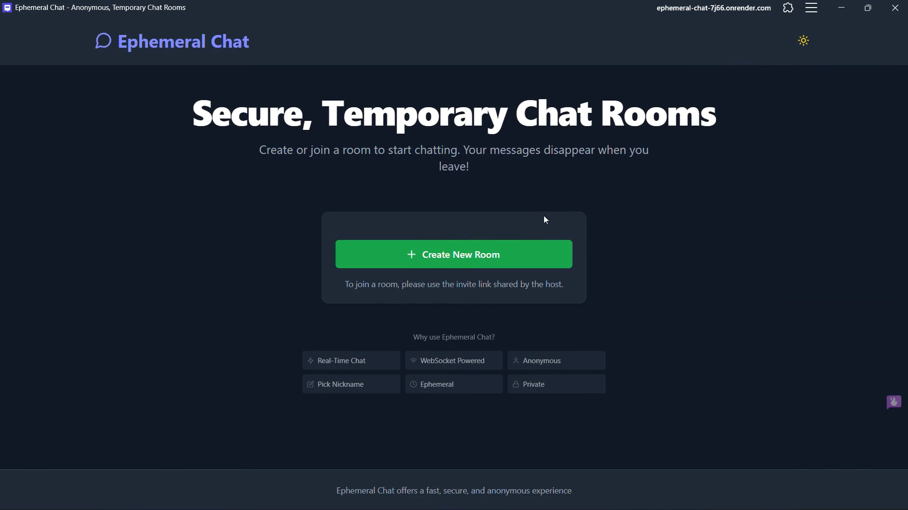
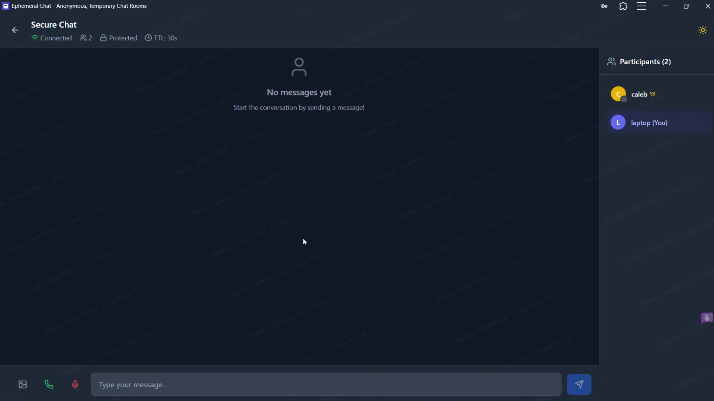

# 🗨️ Ephemeral Chat

<p align="center">
  
</p>

<div align="center">

[](https://opensource.org/licenses/Apache-2.0)
[](https://github.com/cLLeB/ephemeral-chat/issues)
[](https://ephemeral-chat-7j66.onrender.com/)
[](https://www.agora.io/)
[](mailto:kyereboatengcaleb@gmail.com)

**Secure. Anonymous. Ephemeral.**
*Professional-grade, real-time communication that leaves no trace.*

[Features](#-key-features) • [Tech Stack](#-tech-stack) • [Security](#-privacy--security) • [Quick Start](#-quick-start) • [TWA Distribution](#-android-twa-distribution)

</div>

---

## 🎥 Quick Demo
[](https://youtu.be/gnvoWkvkkho)  
*Watch how Ephemeral Chat enables seamless, secure communication.*

---

## 👋 Introduction

**Ephemeral Chat** is a privacy-first communication platform designed for users who value anonymity and security. Whether you need a quick temporary workspace or a secure channel for sensitive discussions, Ephemeral Chat provides a robust, account-free environment where messages disappear the moment they are no longer needed.

Built with a focus on **End-to-End Encryption (E2EE)** and **Real-Time Performance**, the application is available as a web platform, a Progressive Web App (PWA), and an Android-ready Trusted Web Activity (TWA).

---

## ✨ Key Features

### 📡 Real-Time Communication
- **Instant Messaging**: Powered by **Socket.io** for sub-millisecond delivery.
- **📞 HD Voice & Video**: Integrated **Agora RTC** for high-quality, peer-to-peer audio and video calls.
- **🎤 Universal Voice Notes**: Cross-platform recording and playback.
  - *Technical Highlight*: Automated server-side conversion to **AAC (.m4a)** ensures seamless compatibility with iOS Safari and all modern browsers.

### 🛡️ Privacy & Security
- **🔐 End-to-End Encryption (E2EE)**: Messages are encrypted client-side using **AES-GCM (256-bit)**. Encryption keys never leave your browser.
- **🚫 Zero Data Retention**: Messages are stored in-memory (or Redis) and are never persisted to a database.
- **📸 Self-Destructing Media**: Share images with a **view-once** capability.
- **🚪 Knock-to-Join Lobby**: Host-controlled entry system to prevent unwanted guests.

### 📱 Modern Web Experience
- **Progressive Web App (PWA)**: Installable on iOS, Android, and Desktop with offline support.
- **Trusted Web Activity (TWA)**: Fully compatible with Android distribution via the Google Play Store.
- **Adaptive UI**: Responsive design tailored for both mobile and desktop users.

---

## 🛠️ Tech Stack

### Frontend
- **React.js**: Highly responsive UI components.
- **Tailwind CSS**: Modern, utility-first styling.
- **Lucide Icons**: Beautiful, lightweight iconography.
- **Vite**: Ultra-fast build tool and development server.
- **Agora SDK**: Professional-grade real-time engagement.

### Backend
- **Node.js & Express**: High-performance server runtime.
- **Socket.io**: Scalable real-time event engine.
- **Redis**: Low-latency message brokerage and distribution.
- **FFmpeg**: Advanced server-side audio processing.

### Security
- **Web Crypto API**: High-standard cryptographic operations.
- **Rate Limiting**: Protection against brute-force and spam.
- **XSS Prevention**: Strict input sanitization and content security policies.

---

## 🚀 Quick Start

### Prerequisites
- **Node.js** (v18.0.0 or higher)
- **npm** (v9.0.0 or higher)
- **FFmpeg** (Included via static binaries)

### Installation

1. **Clone the Repository**
   ```bash
   git clone https://github.com/cLLeB/ephemeral-chat.git
   cd ephemeral-chat
   ```

2. **Install Dependencies**
   ```bash
   # Root & Server
   npm install

   # Client
   cd client && npm install && cd ..
   ```

3. **Configure Environment**
   Create a `.env` in the root and `client/` directories. Refer to the [Configuration](#-configuration) section.

4. **Launch Development Server**
   ```bash
   npm run dev
   ```

---

## 📱 Android TWA Distribution

The project includes a ready-to-use Android project in the `android/` directory. This allows you to package your PWA as a native APK for the Google Play Store using **Trusted Web Activity (TWA)**.

**Build Requirements:**
- Android Studio / Gradle
- Java 11+

```bash
cd android
./gradlew assembleRelease
```

---

## ⚙️ Configuration

### Server `.env`
```env
PORT=3001
NODE_ENV=production
ALLOWED_ORIGINS=https://your-domain.com
REDIS_URL=redis://localhost:6379

# Agora Credentials
AGORA_APP_ID=your_app_id
AGORA_APP_CERTIFICATE=your_certificate
```

### Client `.env`
```env
VITE_SERVER_URL=https://your-api.com
VITE_AGORA_APP_ID=your_app_id
```

---

## 🤝 Contributing

We welcome contributions of all sizes! 
1. Fork the Project
2. Create your Feature Branch (`git checkout -b feature/AmazingFeature`)
3. Commit your Changes (`git commit -m 'Add some AmazingFeature'`)
4. Push to the Branch (`git push origin feature/AmazingFeature`)
5. Open a Pull Request

---

## 📄 License & Attribution

Distributed under the **Apache License 2.0**. See `LICENSE` and `NOTICE` for more information.

**Author:** Caleb Kyere Boateng  
**Powered by:** [cLLeB](https://github.com/cLLeB/ephemeral-chat)

---

## 🙏 Acknowledgments

- **[Agora.io](https://www.agora.io/)**: For providing the robust Real-Time Engagement (RCE) platform that powers our voice and video calls.
- **[Socket.io](https://socket.io/)**: For the seamless real-time WebSocket communication.
- **[React](https://reactjs.org/)**: For the intuitive UI development experience.
- **[Lucide](https://lucide.dev/)**: For the beautiful and consistent iconography.
- **[Railway](https://railway.app/)**: For the reliable deployment and hosting environment.


---

<div align="center">
  *Designed with ❤️ for a safer, private internet.*
</div>
